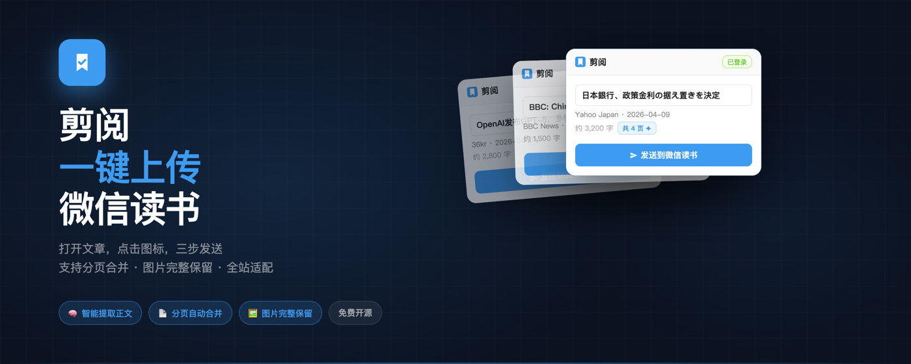
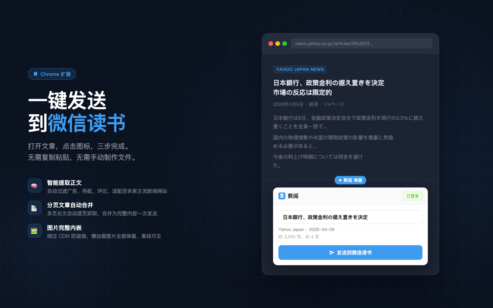
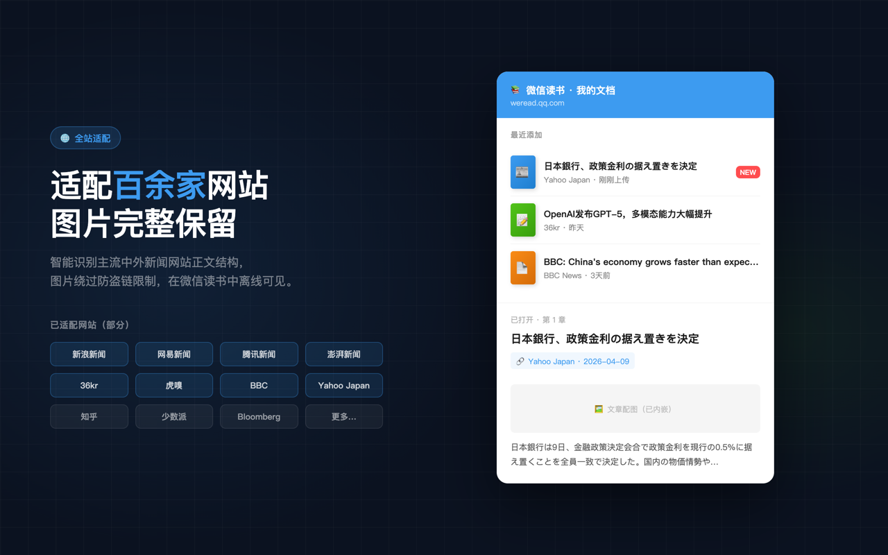

# 剪阅：一键上传微信读书

将任意网页文章一键发送到微信读书的 Chrome 扩展。打开文章、点击图标、发送——三步完成，无需复制粘贴，无需手动制作 EPUB。

---

## 功能亮点

**自动提取正文**
多策略选择器 + 噪音过滤，自动识别广告、导航、评论区等无关内容，只保留真正的文章正文。适配新浪、网易、腾讯、澎湃、36kr、虎嗅等主流中文新闻网站，以及 BBC、Yahoo Japan 等海外网站。

**分页文章自动合并**
检测到分页时（如 Yahoo Japan 新闻的多页长文），自动依次抓取所有后续页面并合并成一篇完整内容，一次发送，无需手动翻页。

**图片完整保留**
在页面上下文中抓取图片，请求自带 Referer，可绕过 BBC、网易等 CDN 的防盗链限制。支持懒加载图片（`data-src`、`data-original` 等属性），图片以内嵌方式写入 EPUB，在微信读书中离线可见。

**生成标准 EPUB**
纯 JS 实现的 EPUB 生成器，无外部依赖。自动填充标题、作者、来源、日期，并在文章头部附上原始链接，方便溯源。

**零感知上传**
不调用微信读书私有 API（接口有动态签名，无法仿造），改为打开官方上传页并自动注入文件，由微信读书官方 JS 完整接管上传流程，稳定可靠。

---

## 安装方式

本扩展正在审核上架 Chrome Web Store，也可手动加载：

1. 下载或克隆本仓库到本地
2. 打开 Chrome，进入 `chrome://extensions`
3. 开启右上角的「开发者模式」
4. 点击「加载已解压的扩展程序」，选择本仓库的根目录
5. 扩展图标出现在工具栏后即可使用

---

## 使用方式

1. 在 [weread.qq.com](https://weread.qq.com) 登录微信读书网页版（一次即可，Cookie 会保留）
2. 打开任意想要保存的文章页面
3. 点击工具栏中的扩展图标
4. 确认提取到的标题和字数，按需修改标题
5. 点击「发送到微信读书」

发送成功后，微信读书的上传页会自动切到前台，可以看到上传进度。稍等片刻后在「书架 → 我的文档」中即可找到该文章。

---

## 技术说明

| 模块 | 说明 |
|------|------|
| `content/content.js` | 正文提取、图片预取、分页合并，运行在网页上下文 |
| `lib/epub.js` | 纯 JS EPUB 生成器，含自制 ZIP 构建器（CRC32、Store 模式） |
| `background/service_worker.js` | 登录校验、EPUB 生成、注入上传页 |
| `popup/` | 弹窗 UI，展示提取结果并触发发送 |

**分页检测优先级：**
1. `<link rel="next">`（语义最强）
2. `<a rel="next">`
3. 含"次へ / 次のページ / 下一页"等文字且 URL 含 `?page=N` 或 `/page/N` 的链接

**为什么不调用微信读书 API？**
上传接口需要动态生成的 `X-Wrpa-0` 签名，参数来源未公开，无法在扩展中重现。注入文件到官方上传页的方案更稳定，且完全不依赖接口细节。

---

## 已知限制

- 需要在 Chrome / Chromium 系浏览器使用（Manifest V3）
- 严格 CSP 或需要登录的页面可能无法提取图片
- 微信读书上传页偶尔加载较慢，发送后请等待上传进度条走完再关闭标签页

---

## 隐私政策

本扩展不收集、存储或传输任何用户个人数据。

- 不记录浏览历史
- 不向第三方服务器发送任何信息
- 对网页的访问权限仅用于提取用户当前浏览页面的文章正文和图片
- 微信读书的登录状态通过浏览器 Cookie 验证，扩展不读取也不存储 Cookie 内容

完整隐私政策：[privacy-policy.md](privacy-policy.md)

---

## License

MIT
